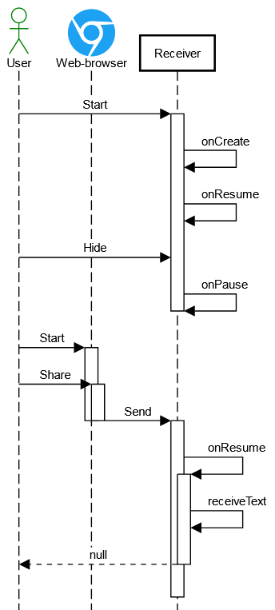

# Shared Text Receiver


First of all, we need to register our app as the plain text receiver by adding the intent filter into the _Manifest_ for a certain activity:
```
<intent-filter>
    <action android:name="android.intent.action.SEND" />
    <category android:name="android.intent.category.DEFAULT" />
    <data android:mimeType="text/plain" />
</intent-filter>
```
The standard way to receive shared text is by calling the _getStringExtra_ method for the intent:
```
final Intent intent = getIntent();
final String stringExtra = intent.getStringExtra(Intent.EXTRA_TEXT);
```
It is also useful to preliminarily check the intent action:
```
final Intent intent = getIntent();
if (Intent.ACTION_SEND.equals(action)) {
  ...
}
```
This code can be called either from the _onCreate_ method if we expect to receive data when the app is started, or from the onResume method if the app has already started and is in the background.

However, there is an issue when the app is called from the background - **sometimes** we receive the _android.intent.action.MAIN_ action instead of _SEND_, and the extra is empty. But why does this happen? When does "**sometimes**" occur? Let's explore this issue.

## Test case #1

1. Our app is shut down
1. Open Web-browser
1. Share some link to the app
1. The app is opened
1. Method _onCreate_ is called
1. Shared text successfully received
1. Switch back to the Web-browser
1. Share link again
1. The _onResume_ method is called this time, and the data can be received.


Nothing odd so far. Let's take a look Test case #2:

## Test case #2

1. Our app is shut down
1. Start the app
1. Hide the app into background
1. Open the Web-browser
1. Share link to the app
1. The _onResume_ method is called, but this time we got no data



Let's look into the logs, there we can see a pair of interesting records:
```
ActivityTaskManager I START 
  u0 {act = android.intent.action.SEND
    typ = text/plain
    flg = 0x13080001 
    cmp = ua.in.asilichenko.sharedtextreceiver/.MainActivity 
    clip = {text/plain {T(475)}}
    (has extras)
  } from uid 10191

ActivityTaskManager I Launching r: 
  ActivityRecord {
    90f60f2
    u0
    ua.in.asilichenko.sharedtextreceiver/.MainActivity
  }
  from background: 
    ActivityRecord {
      90e8155
      u0
      com.android.chrome/com.google.android.apps.chrome.Main
    } 
    t24314}. 
    New task: false
```
The conclusions that can be drawn from this log are:

* Action _android.intent.action.SEND_ with some data was sent indeed, but the app did not receive it
* There is some flag: 0x13080001
* The _ActivityTaskManager_ determined that the app had already run, so it didn't start a new instance but restored the one from the background

The solution to this problem lies in overriding the onNewIntent method:

> This is called for activities that set launchMode to "singleTop" in their package, or if a client used the Intent.FLAG_ACTIVITY_SINGLE_TOP flag when calling startActivity. In either case, when the activity is re-launched while at the top of the activity stack instead of a new instance of the activity being started, onNewIntent() will be called on the existing instance with the Intent that was used to re-launch it. 
>
> An activity can never receive a new intent in the resumed state. You can count on onResume being called after this method, though not necessarily immediately after the completion this callback. If the activity was resumed, it will be paused and new intent will be delivered, followed by onResume. If the activity wasn't in the resumed state, then new intent can be delivered immediately, with onResume() called sometime later when activity becomes active again. 
>
> Note that getIntent still returns the original Intent. You can use setIntent to update it to this new Intent. Dispatches this call to all listeners added via addOnNewIntentListener(Consumer). Handle onNewIntent() to inform the fragment manager that the state is not saved. If you are handling new intents and may be making changes to the fragment state, you want to be sure to call through to the super-class here first. Otherwise, if your state is saved but the activity is not stopped, you could get an onNewIntent() call which happens before onResume() and trying to perform fragment operations at that point will throw IllegalStateException because the fragment manager thinks the state is still saved. 

So it turns out that if the sending application launches our application, the data will continue to be successfully received through the intent. However, in the case where the application was launched separately from the sender, a new intent will be created each time, and the sent data will not be transferred to the new intent. Nevertheless, the original intent from the sender can be obtained in the _onNewIntent_ method.
```
@Override
protected void onNewIntent(Intent intent) {
  super.onNewIntent(intent);
  setIntent(intent);
  receiveText();
}
```


Now, both test cases works fine, but I found another bug.

## Test case #3

1. Our app is in the background
1. Open Web-browser
1. Share a link
1. The app is opened
1. Method _onCreate_ is called


Now, if we look in the background stack, we can see two instances of our app, and that's not good.

To fix this, we need to set launchMode for the main activity to "_singleTask_":
```
<activity
  android:name=".MainActivity"
  android:exported="true"
  android:launchMode="singleTask">
```
In this mode, if there is already an existing instance of the activity in the system, a new one will not be created, and the existing one will be called.


Let's check one more case.

## Test case #4

1. Share data into our app
1. Data is received
1. Rotate the device
1. The same data is received again

This happens because when the Android device is rotated, it recreates the activity, but the intent remains the same. As a result, the processing of shared text in the onCreate method is triggered again, and the read data is also re-read.


To avoid re-reading the data, you need to remove them from the intent using the removeExtra method:
```
if (Intent.ACTION_SEND.equals(action)) {
  final String stringExtra = intent.getStringExtra(Intent.EXTRA_TEXT);
  if (null != stringExtra) {
    ...
    intent.removeExtra(Intent.EXTRA_TEXT);
  }
}
```


# Source code
* [MainActivity.java](app/src/main/java/ua/in/asilichenko/sharedtextreceiver/MainActivity.java)
* [AndroidManifest.xml](app/src/main/AndroidManifest.xml)
* [UML Diagrams](docs/uml) were created by https://sequencediagram.org
